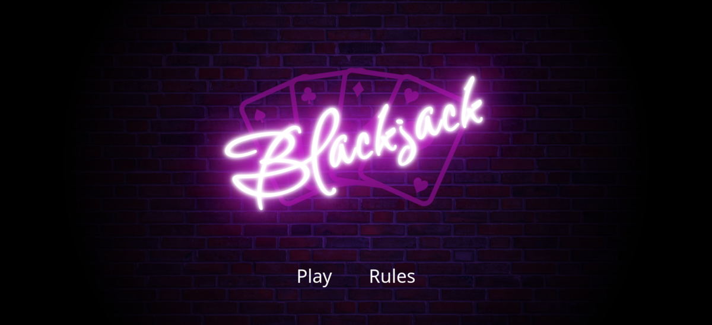
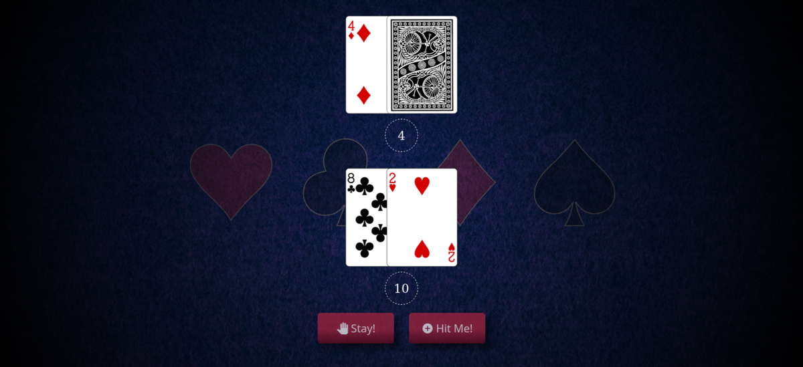

# Blackjack
  
  

## Description 
This web application is built using React.js and utilizes the DeckofCards.com API to bring the classic card game to your browser. Feel free to explore the code, contribute, or simply enjoy a game of cards.

## Demo
Live Demo: [Demo](https://cr-booker.github.io/Blackjack/)

## Getting Started
1. Clone this project  
   ```
   https://github.com/cr-booker/Blackjack.git
   ```

1. Ok with the project cloned lets cd into the directory:  
   ```
   cd Blackjack
   ```

1. Now we install our dependcies for the project
   ```
   npm install
   ```
## Usage
### Start dev server:
   ```
   npm run dev
   ```
### Building a distribution version:  
   ```
   npm run build
   ```
### Locally preview production build
   ```
   npm run preview
   ```
   This will ceate a distribution version of the project inside your local dist/ folder

## Built With
HTML  
CSS  
React  
Vite  
Deckofcards.com Api  
Several forms of magic  
Love

## License
This project is made available under the GNU General Public License v3 (GPLv3)  
Click [here](https://github.com/cr-booker/Blackjack/blob/main/LICENSE) for more details.